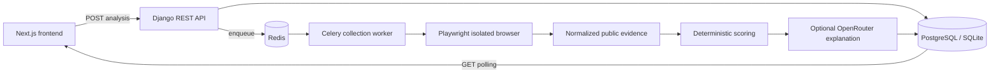

<p align="center">
  
</p>

# CekDulu Backend

[](https://github.com/OweCode-id/CekDulu-backend/actions/workflows/ci.yml)


> The asynchronous evidence pipeline behind **Cek dulu sebelum checkout.**

CekDulu is an evidence-oriented shopping assistant built during a three-day
hackathon. It accepts a public Tokopedia product URL, collects bounded public
evidence in an isolated browser session, calculates a deterministic risk
indication, and returns a structured report that the frontend can poll.

This repository contains the Django API and analysis worker. The web
experience lives in the
[CekDulu frontend repository](https://github.com/OweCode-id/CekDulu-frontend).

## What it does

1. Validates and normalizes a Tokopedia product URL.
2. Creates an asynchronous `AnalysisJob` and sends it to Redis.
3. Runs Playwright in a Celery worker, outside the Django request thread.
4. Collects product, review, and store evidence from public pages.
5. Rejects blocked, insufficient, or invalid collection results honestly.
6. Calculates a deterministic and explainable risk score.
7. Optionally asks an OpenRouter model to explain the fixed result.
8. Stores the report for frontend polling.

CekDulu reports **indications of risk**, not a probability of fraud. It does
not guarantee a safe transaction and does not declare a seller to be a
scammer.

## Architecture



The browser collector never runs inside the HTTP request. This keeps the API
responsive while network navigation, review sampling, scoring, and retries
happen in the background.

## Implemented features

- Django REST API for creating and polling analysis jobs.
- Celery queue backed by Redis, with retry and time-limit handling.
- Playwright Chromium collector using temporary anonymous browser contexts.
- Strict HTTPS Tokopedia URL validation and redirect revalidation.
- Protection against credential-in-URL, unsupported hosts, ports, and product
  paths.
- Product evidence: name, image, current/original price, variations,
  condition, category, description, sold count, rating, and rating count.
- Separate product-review and store-review evidence buckets.
- Store evidence: name, rating, rating count, sold count, and exact Official
  Store badge detection.
- Bounded best-effort review sampling with deduplication and a low-rating
  discovery bucket.
- Deterministic, versioned heuristic scoring with confidence and limitations.
- Optional OpenRouter explanation that cannot modify score, verdict, or
  confidence.
- Explicit failure states for CAPTCHA/access blocks, network errors, timeout,
  and insufficient evidence.
- Request throttling for analysis creation.

## Tech stack

| Area | Technology |
| --- | --- |
| API | Python 3.12, Django 6, Django REST Framework |
| Background jobs | Celery 5, Redis |
| Browser automation | Playwright Python, Chromium |
| Database | PostgreSQL/Neon; SQLite for simple local development |
| AI explanation | OpenRouter API, optional |
| Quality | Ruff, Django test suite, GitHub Actions |

## Try it locally

### Prerequisites

- Python 3.12.
- Docker, or another locally accessible Redis server.
- Git.
- A public Tokopedia product URL for the live collection test.
- Optional: an OpenRouter API key for model-generated explanations.

### 1. Clone the repository

```bash
git clone https://github.com/OweCode-id/CekDulu-backend.git
cd CekDulu-backend
```

### 2. Create the Python environment

<details>
<summary>Windows PowerShell</summary>

```powershell
py -3.12 -m venv env
.\env\Scripts\Activate.ps1
python -m pip install --upgrade pip
python -m pip install -r requirements-dev.txt
python -m playwright install chromium
```

</details>

<details>
<summary>Linux</summary>

```bash
python3.12 -m venv env
source env/bin/activate
python -m pip install --upgrade pip
python -m pip install -r requirements-dev.txt
python -m playwright install --with-deps chromium
```

</details>

On macOS, use `python -m playwright install chromium` if the `--with-deps`
option is not appropriate for the local environment.

### 3. Configure local environment variables

Create `.env` in the repository root. Do not commit this file.

```env
DATABASE_ENGINE=sqlite
PRODUCTION=False
DEBUG=True
DJANGO_SECRET_KEY=local-development-only-change-me
ALLOWED_HOSTS=localhost,127.0.0.1

CELERY_BROKER_URL=redis://localhost:6379/0

TOKOPEDIA_BROWSER_CHANNEL=chromium
TOKOPEDIA_BROWSER_HEADED=False
TOKOPEDIA_BLOCK_RESOURCES=True

# Optional: leave empty to use deterministic fallback explanations.
OPENROUTER_API_KEY=
OPENROUTER_MODEL=deepseek/deepseek-v4-flash
```

`DATABASE_ENGINE=sqlite` is required for the simplest local setup because the
project otherwise expects PostgreSQL configuration.

### 4. Start Redis

First run:

```bash
docker run --name cekdulu-redis -d -p 6379:6379 redis:7-alpine
docker exec cekdulu-redis redis-cli ping
```

The health check should print `PONG`. For later sessions:

```bash
docker start cekdulu-redis
```

### 5. Apply database migrations

```bash
python manage.py migrate
```

### 6. Start Django

```bash
python manage.py runserver 127.0.0.1:8080
```

The API is now available at `http://127.0.0.1:8080`.

### 7. Start the Celery worker

Open another terminal, activate the same virtual environment, and run:

```bash
python -m celery -A cekdulu worker --loglevel=INFO --queues=collection --pool=solo
```

`--queues=collection` is required by the current task routing.
`--pool=solo` is the most portable local option and works on Windows. Linux
users can omit it to use Celery's default worker pool.

### 8. Start the frontend

Follow the
[frontend setup guide](https://github.com/OweCode-id/CekDulu-frontend#try-it-locally),
set `CEKDULU_API_BASE_URL=http://127.0.0.1:8080`, and open
`http://localhost:3000`.

## API usage

### Create an analysis

```http
POST /api/v1/analyses/
Content-Type: application/json

{
  "url": "https://www.tokopedia.com/nama-toko/nama-produk"
}
```

Example with curl:

```bash
curl -X POST http://127.0.0.1:8080/api/v1/analyses/ \
  -H "Content-Type: application/json" \
  -d '{"url":"https://www.tokopedia.com/nama-toko/nama-produk"}'
```

The API returns HTTP `202` with an `id`, current `status`, and `statusUrl`.

### Poll the result

```bash
curl http://127.0.0.1:8080/api/v1/analyses/REPLACE_WITH_ID/
```

Job states are:

- `queued`
- `collecting`
- `analyzing`
- `completed`
- `failed`

PowerShell example:

```powershell
$body = @{
  url = "https://www.tokopedia.com/nama-toko/nama-produk"
} | ConvertTo-Json

$job = Invoke-RestMethod `
  -Method Post `
  -Uri "http://127.0.0.1:8080/api/v1/analyses/" `
  -ContentType "application/json" `
  -Body $body

Invoke-RestMethod `
  -Uri ("http://127.0.0.1:8080/api/v1/analyses/{0}/" -f $job.id)
```

## PostgreSQL / Neon configuration

Replace the SQLite setting with:

```env
DATABASE_ENGINE=postgresql
PGDATABASE=your_database
PGUSER=your_user
PGPASSWORD=your_password
PGHOST=your_host
PGPORT=5432
PGSSLMODE=require
PGCHANNELBINDING=require
```

Never commit database credentials or OpenRouter keys.

## Scoring and AI responsibilities

The collector stores facts. The deterministic analyzer converts those facts
into risk and protective signals, then calculates the final score and
confidence. The current result identifies its method as
`deterministic_heuristic_v2`.

If `OPENROUTER_API_KEY` is configured, the model receives the already-fixed
scoring result and bounded evidence to produce a concise explanation. A model
failure falls back to a deterministic explanation; it does not prevent the
fixed score from being stored.

Marketplace text is treated as untrusted input. Model output is parsed as
structured JSON and is not allowed to override the score, verdict, or
confidence.

## Quality checks

With the virtual environment active:

```bash
python -m ruff check .
python manage.py check --fail-level WARNING
python manage.py makemigrations --check --dry-run
python manage.py test
```

For an isolated local test database in PowerShell:

```powershell
$env:DATABASE_ENGINE="sqlite"
python manage.py test
```

The repository currently contains 43 tests covering URL validation, API
behavior, task state transitions, collection helpers, scoring, models, and
OpenRouter response handling. CI additionally runs against PostgreSQL 17 and
installs Playwright Chromium.

## Privacy and safety boundaries

- Every analysis uses a temporary browser context.
- The collector does not import a user's browser profile, cookies, tokens, or
  credentials.
- It does not log in to Tokopedia automatically.
- CAPTCHA, login walls, access-denied pages, and anti-bot blocks are reported
  as failures; they are not bypassed.
- Only allowed Tokopedia HTTPS product URLs are accepted, and redirects are
  revalidated.
- Review collection is bounded and reviewer identifiers are not required for
  scoring.

## Current limitations

- Tokopedia markup and selectors can change without notice.
- Live collection depends on network conditions and marketplace access, and
  can take tens of seconds.
- Headless Chromium is the default, but some local environments may only work
  with `TOKOPEDIA_BROWSER_HEADED=True` for troubleshooting.
- Product and store review evidence is collected separately, but part of the
  current complaint heuristic still evaluates a combined bounded sample.
- Review samples are intentionally non-representative and must not be treated
  as population statistics.
- Sold counts containing `+` are stored as lower bounds.
- The current backend does not yet retrieve external market-price references.
- This hackathon prototype does not yet include authentication, duplicate-URL
  caching, production CORS policy, or full deployment hardening.

If evidence is insufficient, CekDulu fails the job instead of generating a
misleading score.

## Related repository

- [CekDulu Frontend](https://github.com/OweCode-id/CekDulu-frontend) — landing
  page, live analysis state, and the final evidence report.
